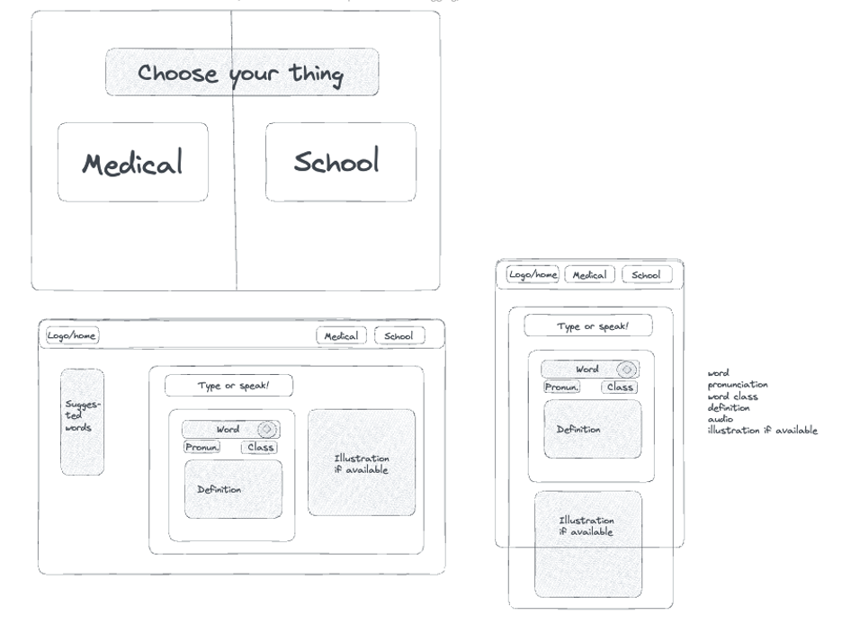
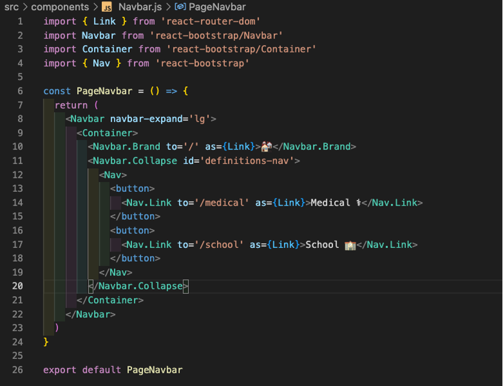
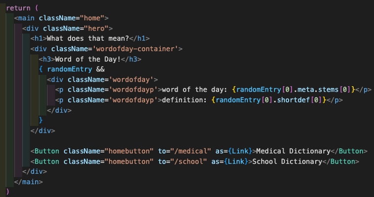
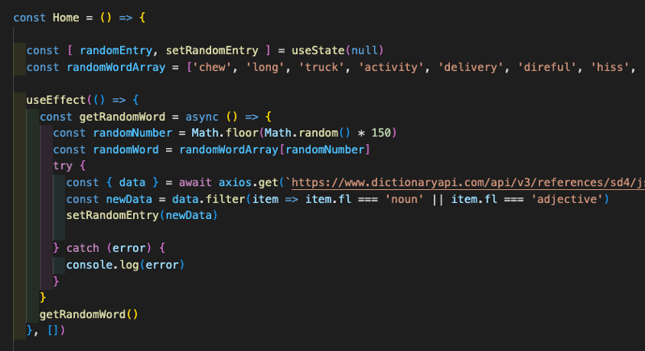
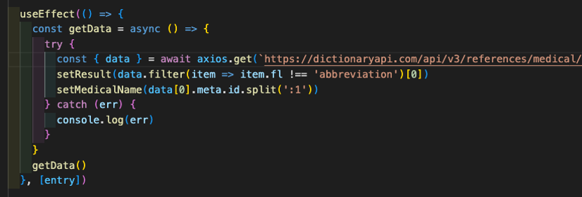
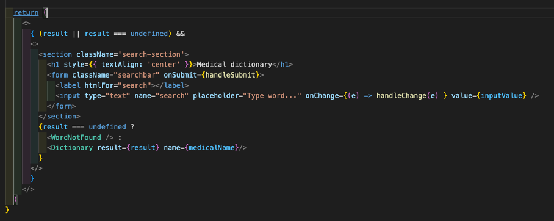
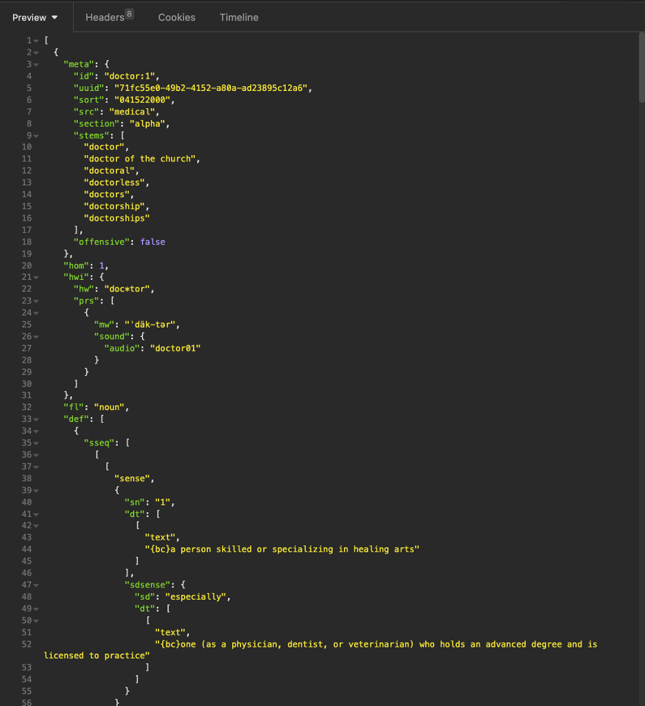
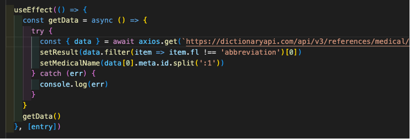

**Merriam-Webster Dictionary App**

**General Assembly Project Two**

This project was to create a React-based App with multiple components that consumed a public API. We completed this at the end of week 6 of the course.

**Deployment link**

<https://schoolmedicaldictionary.netlify.app/> - Deployed project

<https://github.com/hannahbodey/React-API-Project> - Git repo

**Getting Started/Code Installation**

**Timeframe & Working Team**

We had two days to work on this project, including the time that we needed to actually find and source an API. I worked on this project with Giorgia Mineo, <https://github.com/giomine/giomine.github.io>. 

**Technologies Used**

JavaScript React

SCSS, including Bootstrap

Insomnia

Excalidraw

**Brief***​*

The second project is to build a React application that consumes a public API. It must:

- Consume a public API
- Have several components
- The app can have a router with several ‘pages’
- Include wireframes, designed before building the app

**Planning**

We started by discussing our initial ideas. We wanted to build a tool for engaging with different languages or translating certain words, but found it very difficult to find an open-source API to do this. We therefore decided to use the Merriam Webster dictionary. We wanted to twin two dictionaries in order to make our project more interesting. We decided to work with the medical and school dictionary, as we thought that they might be the most different and therefore more interesting to have in comparison.

Having decided upon this, we drafted out a plan on Excalidraw, which featured a home page, on which the user could select their dictionary of choice, and a mobile view:

Initially, we had decided to divide this up with me taking the medical dictionary and Giorgia taking the school dictionary, but as the project progressed, we ultimately did more of this together, and separated out more of the styling. 

**Build/Code Process**

*Routing between pages*

One particular area on which I worked was the home, navbar and routing sections of the project. We put the initial routes in together, and then I completed the navbar and home page individually. I focused on swapping in and out components as we had been taught to do in React. 

Here’s my Navbar route code:

I imported the bootstrap components and then used them inside my functional component, PageNavbar. I set the nav sections to be links by treating them as a link (as={Link}) and giving them a route to follow on click. Each one of these Nav.Links were separated out into buttons that I included in a Navbar. Each button would therefore take the user on click to the route defined in the ‘to=’. This would then swap out the components not in use on that page in the React way, thereby ensuring that the page doesn’t reload each time the user clicks one of these buttons. 

Here are the links in the buttons on the homepage:

As before, I have given each of these buttons a link and a route, and ensured that on click they will direct the user to that defined route. I made sure that the routes matched across this homepage and the nav bar because they needed to take the user to the same endpoint. The consistency was important here. 

*Home page random word*

One thing that I added in particular was a random word of the day on the home page. I thought that this would make the home page more interesting as a start point. I initially wanted to call a separate API that could select a random word, but given the shortness of the time that we have available, decided to simplify this and create an array of random words from which the name and definition would show. Getting the information from the API was complex for this page and also for the dictionary pages, so I spent a fair bit of time considering the API in Insomnia and then logging out each call from the API. 

*Using state and control flow for passing in separate information into the two separate dictionary pages:*

The two dictionaries had different ways of accessing the same bits of information, so we had to work quite hard on control flow and passing information through in state in order to ensure that there were no possibilities for the dictionary to break. Therefore, we added the below filter() and split() to ensure that entries to the dictionary that were structurally more challenging were excluded from our listings. Using setMedicalName() to set the entry to search in the medical dictionary was useful because it meant that writing data[0].meta.etc. each time was unnecessary, and thereby reduced chances for any kind of error. 

At the start of the above code block, you can see { (result || result === undefined) }. We used this to ensure that the below JSX components were only returned if there was a result, or if the result was undefined. To catch undefined results, we also had an additional control flow section where the dictionary entry would not show, and instead you would have a ‘word not found’ message. Having the initial control flow allowed the page to build the search bar regardless of whether or not an appropriate result came back, which ensured that the user would be able to search for a new word without having to refresh the page. 

**Challenges**

A significant challenge was the retrieval of information from the API. The architecture of the API was such that it took a lot of careful deconstruction, and the words were not always retrieved in an intuitive way; for example, when searching ‘cat’ in the school dictionary, the first entry was ‘catalog’, not ‘cat’ the animal. This meant that we had to filter out any abbreviated words which were appearing first in the entries in order to ensure that the logical response was returned to the user. 

There were also instances where the names returned from the dictionary included numbers, e.g. doctor:1 (as seen above). Given that we were unable to check the entire dictionary for these entries, we resorted to simplifying the solution slightly and removing the :1 manually from the entries before they appeared.

Quite a lot of error handling went into this project, which was complex to construct given the diverse and complex nature of the API. In future, I think it would be more efficient to work backwards a little bit more in order to try and anticipate errors and build the error handling as we went through, rather than having to try and build it afterwards, which caused quite a lot of confusion and difficulty. I think this could be achieved by more careful dissection of the API in the first place, especially looking at a wider range of entries in order to try and see in advance the various anomalies that we ended up finding. I think it would then have been helpful to try and map out (either with pseudocode or with another wireframe) what control flow would help where in order to combat any inconsistencies. 

**Wins**

Our dictionary successfully displays on both mobile and desktop, and both dictionaries interact successfully with the API and allow the user to search for a new word. The pages transition neatly and clearly and there is consistency in the interface for the user.

**Key Learnings/Takeaways**

Throughout this project, I greatly improved my understanding of how to access different sections of the API, especially dynamically, so that the page could be relevant and usable with unpredictable user searches. 

Twinned with this, I also feel significantly more confident in the use of separate components in React and passing props down into the component section.

I also feel that I developed my understanding and use of GitHub, as this was the first time that we’d used joint repositories. 

**Bugs**

We were having issues with some entries that were typed in incorrectly, but we think that this has now been resolved. 

**Future Improvements**

We initially wanted to include a search bar that responded to voice commands, but due to time constraints, were not able to add this in. 

It would also have been good to make the ‘similar words’ section contain links to search for those words, but, again, due to time constraints, we were not able to implement this. 
